Blogging for Administrators
===========================

Installation
------------

The extension needs to be installed as any other extension of TYPO3 CMS:

#. Switch to the module “Extension Manager”.

#. Get the extension

   #. **Get it from the Extension Manager:** Press the “Retrieve/Update”
      button and search for the extension key *blog* and import the
      extension from the repository.

   #. **Get it from typo3.org:** You can always get current version from
      `https://typo3.org/extensions/repository/view/blog/current/
      <https://typo3.org/extensions/repository/view/blog/current/>`_ by
      downloading either the t3x or zip version. Upload
      the file afterwards in the Extension Manager.

   #. **Use composer**: Use `composer require T3G/blog`.

Latest version from git
-----------------------
You can get the latest version from git by using the git command:

.. code-block:: bash

   git clone ssh://git@bitbucket.typo3.com:7999/ext/blog.git

Setup
-----

Use the Setup Wizard
^^^^^^^^^^^^^^^^^^^^

The Setup Wizard creates the recommended pagetree and it will add all configurations and plugins you need.

To create a new blog setup, follow these steps:

1. Click on the blog module in the backend
2. Click on the "SetupWizard" tab
3. Click on the "Setup a new blog" button

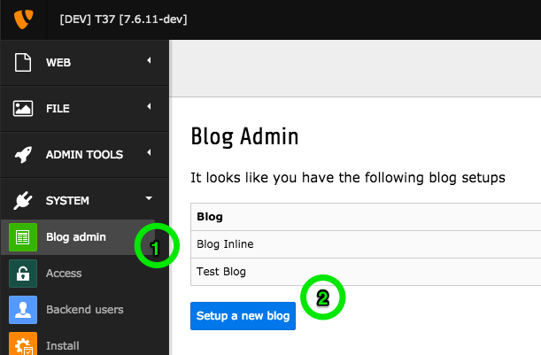

   Create a new blog setup structure

4. Enter a title for the blog setup
5. If the extension "blog_template" is installed, you can use the provided template by enabling the checkbox.
   If the extension "blog_template" is **not** installed, you can install and use it by enabling the checkbox.
6. Click on the "Setup" button, to create the blog setup.

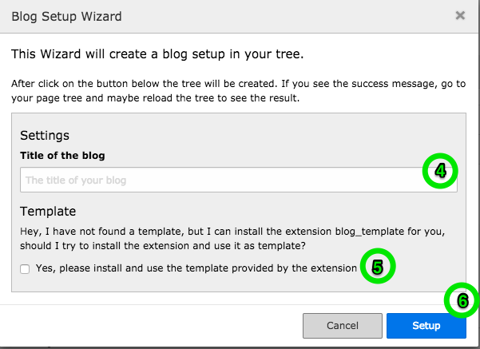

   Modal with setup options

7. If the success message appears, the setup is done. Go to your page tree (maybe reload the tree) and you will see the generated page structure.

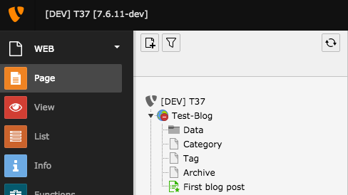

   The generated page structure

The Setup Wizard creates the following pages for you:

- Rootpage (hidden by default, contains the TypoScript and PageTS-Config)
- > Data (a folder to hold categories and tags)
- > Category (this page is used to show blog posts, related to single category, or a category overview)
- > Tag (this page is used to show blog posts, related to single tag, or a tag overview)
- > Archive (this page is the archive, it lists all blog posts by given date (month and year, or year only)
- > First blog post (yes, a first blog post, as an example)

Setup without Wizard
^^^^^^^^^^^^^^^^^^^^

To create a new blog setup, follow these steps:

1) Create the following page structure:

- Rootpage (contains the TypoScript and PageTS-Config)
- > Data (a folder to hold categories and tags)
- > Category (this page is used to show blog posts, related to single category, or a category overview)
- > Tag (this page is used to show blog posts, related to single tag, or a tag overview)
- > Archive (this page is the archive, it lists all blog posts by given date (month and year, or year only)

2) Add at least the TypoScript template which is provided by the extension

3) Configure the page ids in the constants:

.. code-block:: ts

   plugin.tx_blog.settings.blogUid = NEW_blogRoot
   plugin.tx_blog.settings.categoryUid = NEW_blogCategoryPage
   plugin.tx_blog.settings.authorUid = NEW_blogAuthorPage
   plugin.tx_blog.settings.tagUid = NEW_blogTagPage
   plugin.tx_blog.settings.archiveUid = NEW_blogArchivePage
   plugin.tx_blog.settings.storagePid = NEW_blogFolder

4) Optional: Install and use the extension blog_template for a default template set

RealURL Setup
^^^^^^^^^^^^^

RealURL Setup
The blog extension provides a configuration for EXT:realurl.

To get nice looking URLs add the following realurl configuration to your project setup:

.. code-block:: php

    'fixedPostVars' => [
        '<UID_CATEGORY_PAGE>' => 'tx_blog_category',
        '<UID_TAG_PAGE>' => 'tx_blog_tag',
        '<UID_AUTHOR_PAGE>' => 'tx_blog_author',
        '<UID_ARCHIVE_PAGE>' => 'tx_blog_archive'
    ]

Plugin types
------------

The following plugins are available after installing the extension.

List of Posts by Date
^^^^^^^^^^^^^^^^^^^^^

Displays a list of blog posts ordered by date. All non-hidden, non-deleted and non-archived posts are shown in the list.

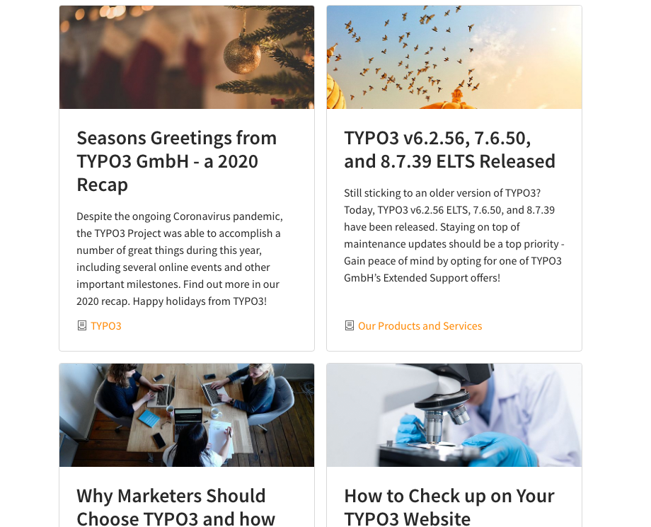

   Frontend view of blog post list.

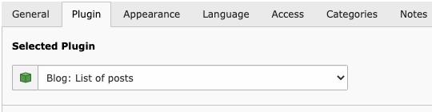

   Backend view of blog post list.

List by Tag
^^^^^^^^^^^^

Allows the users to show all posts tagged with a specific keyword.

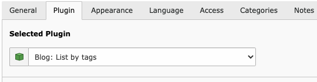

List by Category
^^^^^^^^^^^^^^^^

If you add this element and you have selected a category on the categories tab, it will show an overview of posts for
that category. If you have no categories selected, it will show an overview of categories.

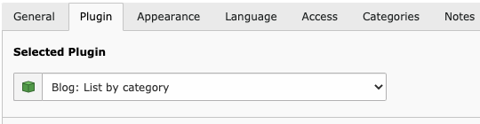

List by Author
^^^^^^^^^^^^^^

Displays all posts belonging to the chosen author.

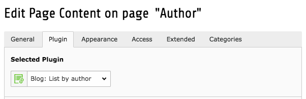

List of related posts
^^^^^^^^^^^^^^^^^^^^^

Based on the categories and tags of the current post, it will show a list of related posts. This overview should only be
placed on a Blog detail page.

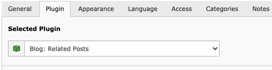

Archive
^^^^^^^

The archive plugin displays all posts categorized by year and month.

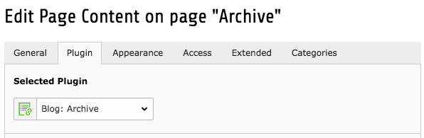

Other plugin types
^^^^^^^^^^^^^^^^^^

Additionally to the list plugin types there are several others meant to give you the maximum flexibility. If you are using the
templates included in the extension you won't need them as they represent parts you'd normally want to have at fixed positions
in your templates. For special circumstances we provide these plugins as standalone versions so you can use them in every
way you want:

Sidebar
"""""""

The sidebar contains links enabling the user to quickly navigate your blog. It shows an overview of recent posts and comments,
categories, tags and archive links.

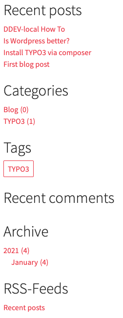

   Sidebar of a blog

Metadata
""""""""
Displays post meta data, like date, tags, category, sharing links...

Authors
"""""""
Displays post authors, like name, title, avatar, social links...

Comments / Comment Form
"""""""""""""""""""""""

Displays the comment form and comments to a post - be aware that commenting in general has to be globally enabled and the
respective post should have the commenting flag set.

Creating Categories and Tags
----------------------------

Categories are the default TYPO3 categories you probably already know.

Create a new category:

* Go to the list module
* Click on the page where you want to create the new category
* Click on the "new record" button on the top and choose category
* Enter a title for the category and choose a possible parent
* Click "Save"

Tags are blog specific records. Creating a new tag works in the same way as creating categories does:

* Go to list module
* Click on the page where you want to create the new tag
* Enter a title for the tag
* Click "Save"

Enable sharing
--------------

To enable sharing go to the page properties of your blog entry and set the check box "Sharing enabled"

AvatarProvider
--------------

The default AvatarProvider is the `GravatarProvider`, this means the avatar of an author is received from gravatar.com.
The extension provides also an `ImageProvider` for local stored images.

But you can also implement your own AvatarProvider:

1) Create a class which implements the `AvatarProviderInterface`.
2) Add your provider to the TCA field "avatar_provider" to make it selectable in the author record