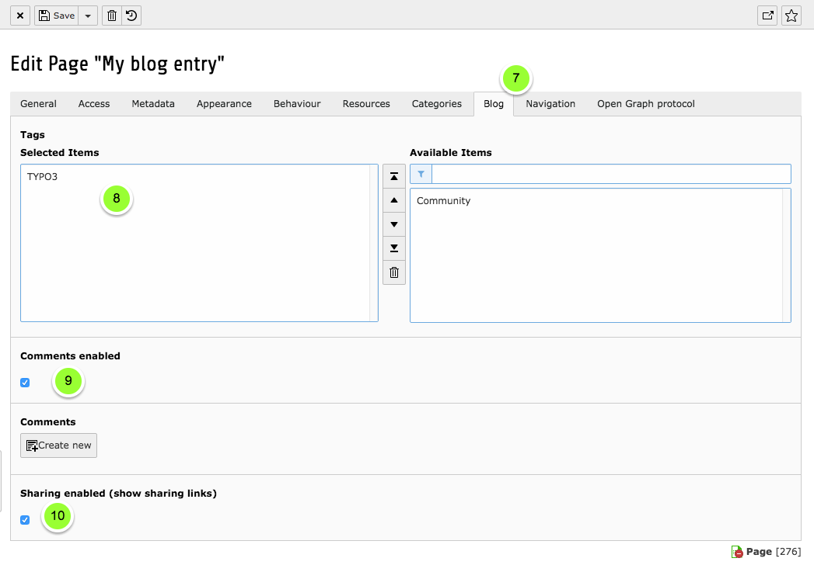
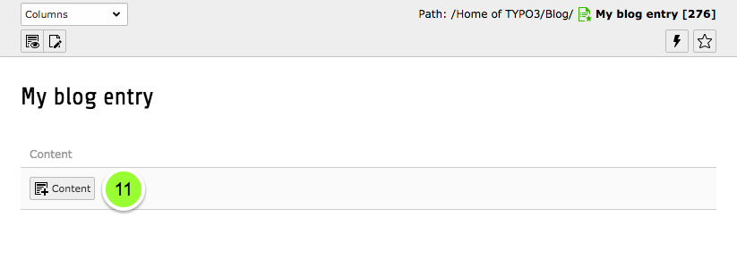

Blogging for Editors
====================

For this how to we are assuming that you are already comfortable working with TYPO3 as an editor and know your way around
the TYPO3 backend.

Create a new post
-----------------

To create a new post, follow these steps:

1. Click on the page module
2. Click on the plus icon on top of the page tree
3. Drag the blog entry page type into the page tree to where you want to create your new post

.. figure:: ../Images/HowTo/1_create_new_post.png

   Create a new blog post page

4. Click on your page in the page tree
5. Click on edit page properties

.. figure:: ../Images/HowTo/2_create_new_post.png

   Go to page properties

6. Make sure your blog post page is not disabled

.. figure:: ../Images/HowTo/3_page_properties_access.png

   Access settings: Enable your entry

7. Click on tab "Blog"
8. Choose tags for your blog post
9. Choose whether you want to enable comments
10. Choose whether you want to enable sharing
11. Define an archive date if your want to remove a blog post by given date from the main list (not for tag, category, date or archive lists)

.. note::

   If you want to add categories do so with the normal TYPO3 categories (Tab: Categories)

   Blog entry settings

Add content to your post
-------------------------

11. Add content elements to your blog post page

.. note::

   You can add all kinds of content elements that you are using on the rest of your web site, too. The blog itself doesn't
   provide any special elements for the content of your blog entry as sticking close to the rest of your website ensures a
   consistent look and feel for your visitors.

