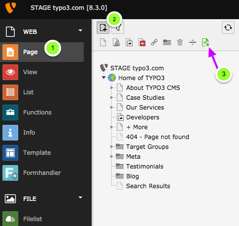
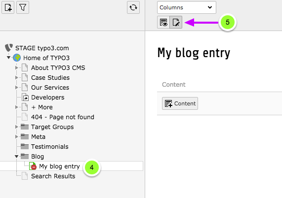
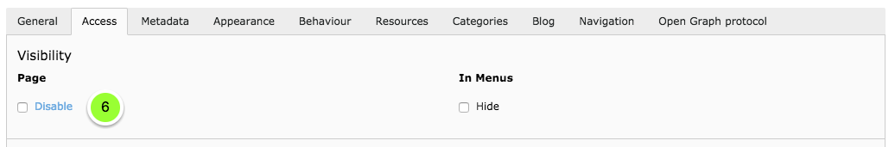
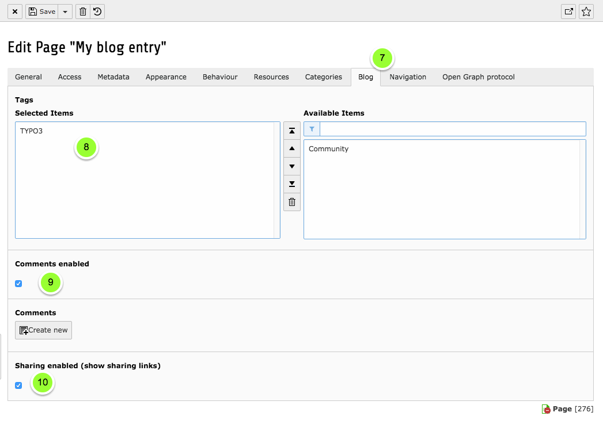
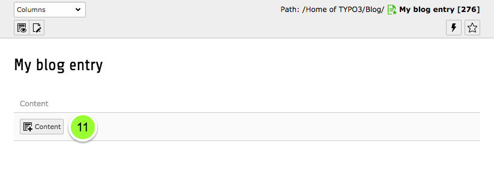
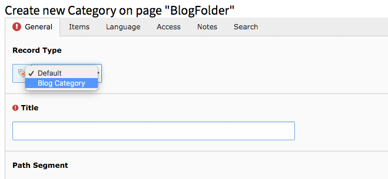

.. include:: ../../Includes.txt

.. _GuidePosts:

=====
Posts
=====

Create a new post
-----------------

To create a new post, follow these steps:

1. Click on the page module
2. Click on the plus icon on top of the page tree
3. Drag the blog entry page type into the page tree to where you want to create your new post

   Create a new blog post page

4. Click on your page in the page tree
5. Click on edit page properties

   Go to page properties

6. Make sure your blog post page is not disabled

   Access settings: Enable your entry

7. Click on tab "Blog"
8. Choose tags for your blog post
9. Choose if you want to enable comments
10. Define an archive date if your want to remove a blog post by given date from the main list (not for tag, category, date or archive lists)

.. note::

   If you want to add categories do so with the normal TYPO3 categories (Tab: Categories)

   Blog entry settings

Add content to your post
-------------------------

11. Add content elements to your blog post page

.. note::

   You can add all kinds of content elements that you are using on the rest of your web site, too. The blog itself doesn't
   provide any special elements for the content of your blog entry as sticking close to the rest of your website ensures a
   consistent look and feel for your visitors.

Set a details page for an author
--------------------------------

1. Go to the properties page of an author
2. Click on the "Blog data" tab
3. Set a details page for the author to link to as it's details page

Create a blog category (since v10)
----------------------------------

1. Go to your system folder with the records of your blog data
2. Click on the “Create new record” plus icon
3. Select “category” in the system records
4. Choose the record type “blog category”

Create a featured image (since v10)
-----------------------------------

1. Edit page properties
2. Click on the “Blog” tab
3. Create a “Featured Image” as new relation or select & upload a file

**NOTE:** The featured image will be displayed in all blog lists. Since v10 it has also been shown in the RSS feed. The “Blog: Header” plugin is available to display it in the blog post.
