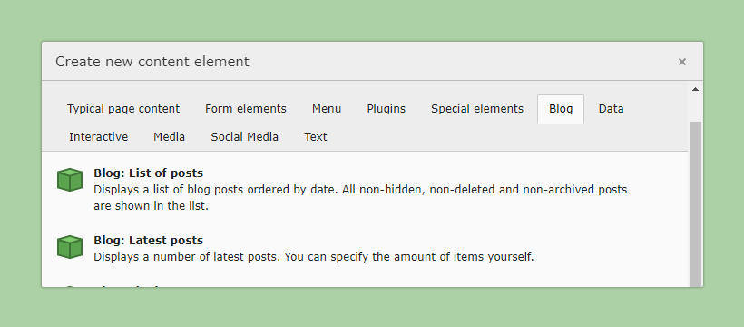

.. include:: ../Includes.txt

.. _Plugins:

=======
Plugins
=======

The following plugins are available after installing the extension.

.. contents::
   :local:
   :depth: 2

.. _BlogPagePlugins:

Blog Page Plugins
=================

Blog page plugins are usually used in conjunction with a sidebar,
it is recommended to provide a separate template for these pages.

Example:

.. code-block:: html

   <f:layout name="Default" />
   <f:section name="Main">

      

         

               <main class="blogcontainer-main" role="main">
                  <f:cObject typoscriptObjectPath="lib.dynamicContent" data="{
                           colPos: '0'
                     }" />
               </main>
               <aside class="blogcontainer-sidebar">
                  <f:render section="renderPlugin" arguments="{listType: 'blog_sidebar'}" />
               </aside>
         

      

   </f:section>
   <f:section name="renderPlugin">

      {blogvh:data.contentListOptions(listType: listType)}
      <f:cObject typoscriptObjectPath="tt_content" data="{contentObjectData}" table="tt_content"/>

   </f:section>

List of posts
-------------

Displays a list of blog posts ordered by date. All non-hidden, non-deleted and
non-archived posts are shown in the list.

Latest posts
------------

Displays a number of latest posts. You can specify the amount of items yourself.

List by category
----------------

If you add this element and you have selected a category on the categories tab,
it will show an overview of posts for that category. If you have no categories
selected, it will show an overview of categories.

List by author
--------------

Displays all posts belonging to the chosen author.

List by tags
------------

Allows the users to show all posts tagged with a specific keyword.

Archive
-------

The archive plugin displays all posts categorized by year and month.

.. _BlogPostPlugins:

Blog Post Plugins
=================

If possible, do **not** add the following plugins manually on each blog post.
Provide them via a Dedicated Page Template, so your editor can concentrate on the content.

Example:

.. code-block:: html

   <f:layout name="Default" />
   <f:section name="Main">

      

         

               <main class="blogcontainer-main" role="main">
                  <f:render section="renderPlugin" arguments="{listType: 'blog_header'}" />
                  <f:cObject typoscriptObjectPath="lib.dynamicContent" data="{colPos: '0'}" />
                  <f:render section="renderPlugin" arguments="{listType: 'blog_footer'}" />
                  <f:render section="renderPlugin" arguments="{listType: 'blog_authors'}" />
                  <f:render section="renderPlugin" arguments="{listType: 'blog_comments'}" />
                  <f:render section="renderPlugin" arguments="{listType: 'blog_commentform'}" />
                  <f:render section="renderPlugin" arguments="{listType: 'blog_relatedposts'}" />
               </main>
               <aside class="blogcontainer-sidebar">
                  <f:render section="renderPlugin" arguments="{listType: 'blog_sidebar'}" />
               </aside>
         

      

   </f:section>
   <f:section name="renderPlugin">

      {blogvh:data.contentListOptions(listType: listType)}
      <f:cObject typoscriptObjectPath="tt_content" data="{contentObjectData}" table="tt_content"/>

   </f:section>

Header
------

Displays post header

Footer
------

Displays post footer

Comment Form
------------

Displays the comment form for a post.

Comments
--------

Displays the comments for a post.

Authors
-------
Displays post authors, like name, title, avatar, social links..

Related Posts
-------------

Based on the categories and tags of the current post, it will show a list of
related posts. This overview should only be placed on a Blog detail page.

Shared Plugins
==============

Sidebar
-------

The sidebar contains links enabling the user to quickly navigate your blog. It
shows an overview of recent posts and comments, categories, tags and archive
links.

- :ref:`Usage on Blog Pages <BlogPagePlugins>`
- :ref:`Usage on Blog Posts <BlogPostPlugins>`
